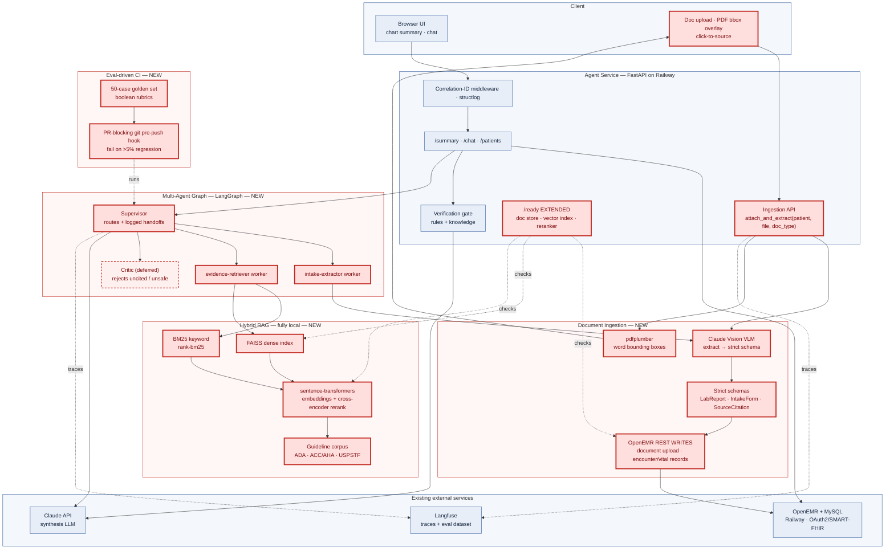

# W2_ARCHITECTURE — Clinical Co-Pilot, Week 2

> **Status:** built. Every stage (ingestion, RAG, worker graph, eval gate,
> observability) has landed and is reflected below. Week 1 baseline lives in
> `./ARCHITECTURE.md`; this document covers **only** the Week 2 multimodal +
> multi-agent additions. File/line references point at `agent/src/copilot/`.

## 1. Week 1 baseline vs. Week 2 additions

Week 1 shipped a read-only agent over OpenEMR's OAuth2/SMART-FHIR API: grounded,
cited chart summaries with deterministic verification, panel + role gates, PHI
scrubbing, Langfuse observability, a starter eval suite, and a Railway
deploy. **Week 2 adds two capabilities without forking that core:** the agent
can now _see_ clinical documents, and it _routes_ work across a small,
inspectable multi-agent graph — gated by an eval-driven CI that blocks
regressions.

Everything in Week 1 is reused unchanged except **two** deliberate changes,
both additive:
- OpenEMR gains a **write path** (was read-only) — source documents + derived
  OpenEMR records (via **REST**; FHIR-native create is unavailable on this build,
  confirmed by the PRP-00 spike) round-trip back in.
- Langfuse gains **new trace spans** for the graph + ingestion flows.

## 2. Architecture (red = new Week 2 infra)

**Reading it:** four new red subsystems (Ingestion, Graph, RAG, Eval CI) bolt
onto an otherwise-blue Week 1 core. The only two red edges into blue boxes are
the new REST write path and the new Langfuse spans — the sole places Week 2
touches Week 1 behavior.

## 3. Technology decisions

### 3.1 New in Week 2

| Capability | Tech | Choice | Rationale |
|---|---|---|---|
| Orchestration | **LangGraph** | supervisor + 2 workers, in-memory state | inspectable graph, explicit logged handoffs |
| Dense vectors | **FAISS** (`faiss-cpu`) | in-process flat index | no server; rebuilds <1s for a tiny corpus |
| Keyword retrieval | **rank-bm25** | BM25Okapi | sparse half of hybrid; pure-Python |
| Embeddings + rerank | **sentence-transformers** | `bge-small-en-v1.5` embed + `ms-marco-MiniLM-L-6-v2` cross-encoder | local; "equivalent reranker" allowed; small weights |
| Vision extraction | **Claude vision** (existing SDK, new usage) | Opus 4.8, PDF/image blocks → strict `parse()` | all-Anthropic; schema constrains VLM output |
| PDF text + bboxes | **pdfplumber** | word-level bounding boxes | powers citation overlay w/o OCR infra |
| Generate demo PDFs | **reportlab** | dev/test asset only | synthetic text-layer PDFs, no real PHI |
| Git gate | **native git pre-push hook** | shell script | runs 50-case suite; fails on >5% regression |

Heaviest transitive dep: **PyTorch** (via sentence-transformers). Mitigated by
choosing small model weights (~80–130 MB each), not the large `bge-reranker`
variants — keeps the Railway image lean.

### 3.2 Reused from Week 1 (no new tech)

Pydantic v2 (strict contracts) · Langfuse (traces + eval dataset) · pytest
(golden-set runner) · structlog (structured logs + correlation IDs) · tenacity
(retries/timeouts/breakers) · `scrub_phi` (PHI scrubbing + `no_phi_in_logs`
check) · FastAPI auto-generated OpenAPI 3.0 · vanilla HTML/CSS UI · Railway +
Docker.

### 3.3 Decisions (resolved)

- **FAISS vs sqlite-vec** — **FAISS** (`IndexFlatIP`, in-process). The corpus is
  12 chunks and rebuilds in <1s, so a backup-able index file bought nothing; the
  index is derived data, reproducible from the committed corpus (see
  `BACKUP_RECOVERY.md`), so there is nothing to back up.
- **Vision model** — **Opus 4.8** for extraction. The cost report
  (`W2_COST_LATENCY.md`) shows ingestion is VLM-bound but dev spend is trivial
  (~$0.38 total) and extraction accuracy matters more than latency for a
  point-of-care read, so the more capable model wins.

## 4. Document ingestion flow

`attach_and_extract(patient_id, file_path, doc_type)` (`documents/ingest.py:131`)
for `lab_pdf` and `intake_form`: store source in OpenEMR → Claude vision → strict
schema (schema is the source of truth; raw VLM output never bypasses validation)
→ persist derived facts as **OpenEMR records via REST** → link every fact to
`{doc, page, field}`. **Write path (PRP-00 spike, resolved):** FHIR-native create
is unavailable on this build, so the source PDF is stored via
`POST /api/patient/:pid/document` and derived values as encounter/vital records
(`documents/openemr_write.py`), made idempotent by a source SHA-256 dedup key
(spec allows "FHIR resources **or** OpenEMR records"). **Bounding-box strategy:**
generate text-layer demo PDFs so `pdfplumber` yields exact word boxes
(`extract.py:_find_box`); one document degraded to image-only to demo graceful
page-level fallback.

**Chart-read path (PRP-15/17):** the co-pilot also reads documents *already in
the chart* that the front desk/nurse/portal uploaded — no physician upload. It
lists via FHIR `DocumentReference`, fetches bytes via FHIR `Binary`, and reuses
the same extract+persist pipeline (`documents/chart_read.py`), grounding every
citation to the stable OpenEMR document id. This is the path `/ask` uses.

## 5. Worker graph

A LangGraph `StateGraph` (`graph/supervisor.py:build_graph`) with a **supervisor**
node and two workers — `intake_extractor` and `evidence_retriever`. The
load-bearing design choice: the supervisor never calls a worker directly. It
writes its decision into the shared state as a `Handoff` record, and a
conditional edge routes on the *last* handoff's `to_node` — so **the handoff log
IS the routing instruction** (not a side-channel trace). `_decide`
(`supervisor.py:70`) checks, in order: max-steps guard → attachments needing
extraction → question needing evidence → else `done`. A typical run logs
`supervisor→intake_extractor`, `supervisor→evidence_retriever`, `supervisor→done`
and `steps == len(handoffs) == 3`.

**Worker-failure containment (a QA-loop fix):** if a worker raises, the node does
**not** propagate (`workers.py:_make_worker_node`). Propagating would destroy the
inspectable handoff log and let a PHI-bearing exception message escape the
scrubber. Instead it appends a terminal handoff naming only `type(exc).__name__`
(never `str(exc)`), records the worker's timing, flips `done`, and routes to
`END` so the failing worker isn't re-dispatched — the log survives intact.

**Observability threading:** each worker span is a child of the single
`graph.supervisor` span; the correlation ID propagates from the Week-1 middleware
into every node, VLM call, retrieval call, and FHIR write (verified end-to-end).
Every `/ask` run emits one PHI-free `EncounterMetrics` event
(`api/w2flow.py:build_encounter_metrics` → `observability.record_encounter_metrics`)
carrying all seven required signals — tool sequence, step + per-worker latency,
token usage, cost estimate, retrieval hit-rate, extraction confidence, and the
online eval outcome — plus a searchable `w2flow.ask.metrics` structured log line.

## 6. RAG design

Small clinical-guideline corpus (ADA Standards of Care 2025, 2017 ACC/AHA
hypertension, USPSTF statin) matched to the demo panel's conditions — 3 markdown
files, chunked **structurally** (one chunk per `##` section, 12 chunks total),
each carrying its own citation metadata from YAML front-matter so *the chunk is
the citable unit* (`rag/chunk.py`). Hybrid retrieval (`rag/retrieve.py:154`):
BM25 (sparse, `rank-bm25`) + `bge-small-en-v1.5`→FAISS `IndexFlatIP` (dense)
rankings → **Reciprocal Rank Fusion** (unweighted, `k=60`) → top-8 pool →
`ms-marco-MiniLM-L-6-v2` cross-encoder rerank → **top-4** evidence only to the
answer model. Patient-record facts and guideline evidence are separated by
**type** (distinct citation shapes), never merged (FR-6). Note: retrieval always
returns top-4 (no score cutoff); abstention is enforced downstream by the
grounding gate and caveats-only synthesis, not by a retrieval threshold.

## 7. Eval gate

50 synthetic/demo cases (`agent/tests/eval/golden/cases/`: 15 extraction,
10 evidence, 10 citation, 8 refusal, 7 missing-data) exercising extraction,
evidence retrieval, citations, refusals, and missing-data behavior. Boolean
rubrics only — five deterministic Python evaluators (`evals/w2_runner.py`), no
LLM-as-judge: `schema_valid`, `citation_present`, `factually_consistent`,
`safe_refusal`, `no_phi_in_logs`. The gate (`evals/gate.py`) **fails the build
if any category regresses >5% absolute or drops below the 0.90 pass threshold**,
comparing a fresh run against the committed `baseline.json`. It runs as step 3 of
the PR-blocking `.githooks/pre-push` (and `make ci`); step 4 is a fail-closed
PHI scan. The golden set + baseline live in the repo (reproducible without a
database — see `BACKUP_RECOVERY.md`). Proven behavior: clean=green, injected
regression=red-naming-the-category, planted PHI=red (`tests/test_eval_gate.py`,
`tests/test_phi_check.py`).

## 8. Risks & tradeoffs

| Risk | Mitigation |
|---|---|
| VLM hallucinates fields / overstates confidence | strict schema gate + source citation required per field; critic rejects uncited claims |
| PDF bbox overlay needs pixel coords Claude can't emit | generate text-layer PDFs → `pdfplumber` exact boxes; no OCR pipeline |
| FHIR-native writes unavailable (confirmed by PRP-00 spike) | REST write path: `POST /api/patient/:pid/document` + encounter/vital records; idempotent via source SHA-256; spec permits OpenEMR records |
| PyTorch bloats the Railway image | small model weights only; consider CPU-only wheels |
| Multi-replica breaks in-memory graph/session state | documented single-instance constraint; shared store is hardening-tail work |

## 9. Testing strategy

The suite is hermetic: `pytest -q` is green with **no docker, no API key, no
network** (455 passed, 2 `live`-marked tests deselected by default via
`addopts = -m "not live"`). Every LLM/VLM/OpenEMR call is stubbed through an
injectable seam. Each layer guards a specific failure mode:

| Layer | What it covers | Failure mode it guards against |
|---|---|---|
| **Unit** | schema validators (`test_document_schemas`, `test_clinical_schemas`), citation shape, retrieval scoring/fusion, PHI scanner (`test_phi_check`), cost estimator | a VLM field label / out-of-range confidence / missing citation slips through un-validated; a PHI pattern stops being detected |
| **Contract** | supervisor↔worker routing + handoff log (`test_graph`), `/ask` response contract (`test_w2flow`), OpenAPI drift (`test_openapi_contract`) | a graph edit silently changes routing or drops the handoff log; the published API spec falls out of sync with the code |
| **Integration (no live API)** | full ingestion→answer path with fixture docs + stubbed LLM/VLM (`test_m2_integration`, `test_ingest`, `test_orchestrator`) | a wiring regression between ingest → extract → persist → synthesize → gate that unit tests miss |
| **Observability** | per-encounter metrics carry all 7 signals; `/ask` emits exactly one metrics event (`test_w2flow` metrics tests) | a metric silently stops being emitted (the core-#7 regression) |
| **Golden set (behavior)** | the 50 boolean-rubric cases via the eval gate | extraction/citation/grounding/refusal/PHI behavior regresses >5% — the graded hard gate |
| **Live (opt-in, `-m live`)** | `/ready` against the real local stack + reranker | the readiness probes misreport a genuinely-down dependency |

**Not tested, and why.** (1) The *live* Anthropic vision + synthesis calls are
exercised only at the explicit LIVE smokes (PRP-06/14), never in CI — a real key
costs money and makes CI non-deterministic; the schema gate + stubs cover the
wiring, and the golden set covers behavior. (2) Load/throughput under concurrency
is measured out-of-band (`loadtest/`), not asserted in unit CI, because it needs
a running stack. (3) OpenEMR's own FHIR server is treated as a trusted external
dependency (probed by `/ready`), not re-tested here.

## 10. Failure modes & recovery

Each Week-2 failure mode, how to spot it in the structured logs (all searchable
by `correlation_id`), and the recovery action:

| Failure mode | How to identify (log signal) | Recovery action |
|---|---|---|
| **Document ingestion failure** (upload/store rejected) | `IngestError` / `FhirError` log event with the correlation id; `/ready` `document_storage` = `unreachable`/`degraded` | retry is automatic (tenacity) on transient 5xx; if persistent, check OpenEMR REST auth + the `document_storage` probe; source dedup key makes re-ingest idempotent (no duplicates) |
| **Extraction schema violation** (VLM output fails the strict schema) | `answer.synthesize.unparseable` / `ExtractionError` (type only, no PHI); extraction confidence absent in `encounter.metrics` | fail-closed by design — the raw VLM output is rejected, never surfaced; re-run extraction; if repeatable, inspect the source scan quality (image-only → page-level citation fallback) |
| **RAG returns no results** (retrieval empty / irrelevant) | `encounter.metrics.retrieval_hit_rate` low/`null`; answer emits caveats-only | not an error — the model abstains ("insufficient evidence") rather than guess; verify the corpus loaded via `/ready` `vector_index`; widen the query if a real gap |
| **Supervisor routing error** (worker raises / loop) | terminal `Handoff` whose reason names the exception *type*; `worker_latencies[].success = false`; `steps` hits the max-steps guard | graph terminates cleanly with the handoff log intact and the grounded remainder stands; read the handoff log to see where it stopped; the `recursion_limit` backstops any loop |
| **Reranker / vector index down** | `/ready` = `degraded` (200, not 503), names `reranker`/`vector_index` in `degraded[]` | non-gating — serving continues; reinstall/warm the model weights; retrieval degrades to fusion-only if the cross-encoder can't load |
| **Eval regression** (a rubric category drops) | `make ci` / pre-push step 3 exits non-zero naming the category; monitoring alert on >5% drop | the push/PR is blocked before merge; fix the regression or, if intentional, regenerate the baseline with `make update-baseline` (reviewed) |

## 11. Data model, authority, lineage & access control

One source of truth per data type; no silent overwrites. Every Week-2 artifact:

| Artifact | Authoritative owner | Lineage (where it comes from) | Access control | Validation |
|---|---|---|---|---|
| **Source document** (lab PDF / intake form) | **OpenEMR** (documents table) | front-desk/nurse/portal upload, or `attach_and_extract` upload | OpenEMR OAuth2/SMART scopes; agent reads with `user/DocumentReference.read` + `Binary.read`, panel + role gated | stored under a deterministic `copilot_<sha256>` filename; SHA dedup prevents duplicates |
| **Extracted lab observation** | **OpenEMR** (encounter/vital record, written via REST) | VLM extraction of a source document, schema-validated | same OpenEMR scopes; write path is agent-only | `LabReport`/`LabObservation` Pydantic schema (`extra="forbid"`, `frozen`); confidence clamped by grounded fraction |
| **Extracted intake fact** | **the source document** (OpenEMR) — stored, not re-persisted as a record | VLM extraction, schema-validated | OpenEMR scopes | `IntakeFacts` schema; each field carries its own `SourceCitation` |
| **Guideline chunk** | **the repo** (`rag/corpus/*.md`) — committed, version-controlled | authored corpus + YAML front-matter | public guidance (no PHI); read-only at runtime | one `##` section per chunk; `GuidelineChunk` schema; deterministic `chunk_id` |
| **Citation record** | **derived** (never authoritative on its own) | assembled from the above at answer time | inherits the source's access control | `SourceCitation` (5 required fields); record facts vs guideline evidence kept in distinct, never-merged lists |
| **Per-encounter metrics** | **observability sink** (Langfuse + structured logs) | assembled at `/ask` time from graph result + answer | operational only; PHI-free by construction + `scrub_phi` defence-in-depth | `EncounterMetrics` schema (`extra="forbid"`); structural values only |

**Schema evolution / migration:** Week 2 introduced **no database schema
migration** — derived facts are written into *existing* OpenEMR tables via REST
(document upload + encounter/vital records), and all new contracts
(`LabReport`, `IntakeFacts`, `SourceCitation`, `GraphState`, `EncounterMetrics`)
are additive Pydantic models with no change to any Week-1 schema. See
`MIGRATIONS.md`.

