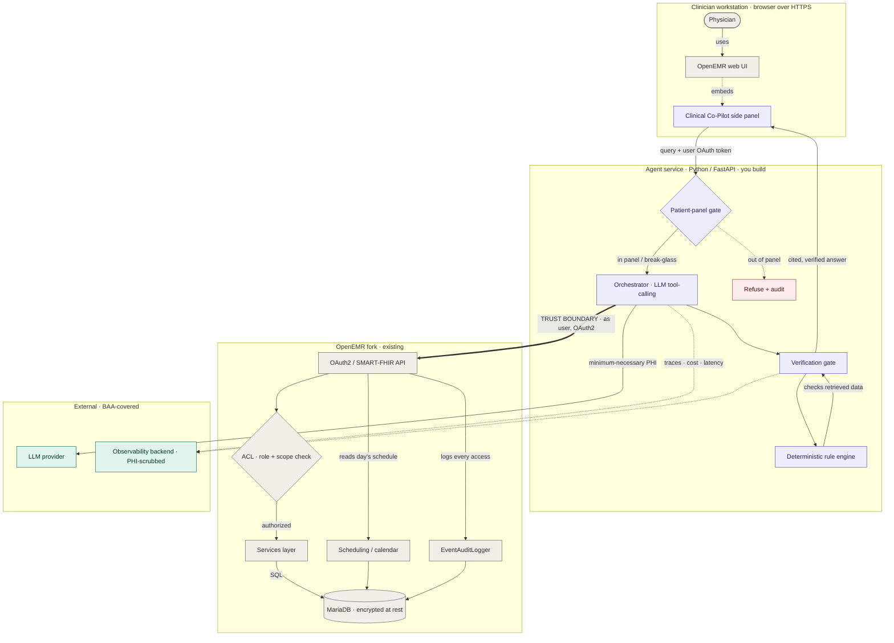
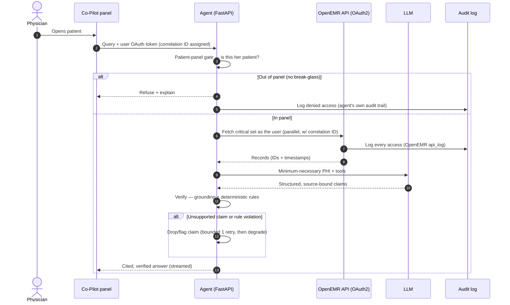

# Clinical Co-Pilot — Product Requirements Document (PRD)

**Version:** 1.0 · **Date:** 2026-07-09
**Sources:** `ARCHITECTURE.md`, `USER.md`, `AUDIT.md` (repo root)
**Status:** Approved for build — Milestone 0 next

---

## 1. Summary

The Clinical Co-Pilot is a conversational side panel inside OpenEMR for one narrow user — a primary care physician who, in the 60–90 seconds before a visit, needs a grounded picture of what changed since the last visit and what matters today. It is **not** a general medical chatbot; every capability traces to that moment and to a use case in this document.

The agent is a **separate Python/FastAPI service** (built in `/agent`) that reads patient data **only** through OpenEMR's OAuth2/SMART-on-FHIR API — never the database or service layer. This "isolation with borrowed identity" is forced by the audit: OpenEMR's patient-read path runs raw SQL with no authorization, so anything below the API inherits none. Going through the API as the logged-in clinician means each read carries her token, obeys OpenEMR's coarse role gate, and lands in the existing audit log — and because the agent never holds a privileged account, it can surface nothing the user couldn't see herself. On top of that the agent adds the one thing OpenEMR lacks: a **patient-panel gate** (schedule/care-team), because OpenEMR's permissions are never patient-scoped.

Trust is enforced **structurally** — the model must bind every claim to a source record, a deterministic rule engine (not an LLM) checks the retrieved data, and unverified content never reaches the physician as fact.

---

## 2. Problem & Target User

**Problem.** A physician has ~90 seconds between patient rooms to recall who this patient is, why they're here, what changed since the last visit, and what matters today. Today that means scanning dense notes and flipping between the problem list, medication list, and labs — under time pressure, with the patient waiting. The cost is missed medication changes, overlooked abnormal labs, and rushed context-building.

**Target user — Dr. Alani Reyes, primary care physician, 20-patient clinic day** (see `USER.md §1`). She does **not** pre-read charts; her need is *at the door, in the moment*. Her tolerance profile constrains the whole design:
- **Latency:** first useful content in ~1–2 s; a multi-second spinner loses her.
- **Trust:** zero tolerance for a confident wrong statement; she must see the source of any claim.
- **Failure:** a partial answer that says what's missing is fine; a silent gap or a crash is not.

---

## 3. Goals & Non-Goals

**Goals**
- Deliver a grounded, cited synthesis of a patient at the point of care in seconds.
- Enforce that a physician sees only their own patients (patient-panel gate), and that the wrong role is refused.
- Guarantee that every clinical claim is traceable to a real record, and that domain-rule violations are caught deterministically.
- Meet the engineering bar: correlation IDs, canonical schemas, `/health`+`/ready`, observability, eval suite, load tests.

**Non-Goals** (explicitly out of scope — see `USER.md §5`)
- Generic medical Q&A / medical education.
- Autonomous clinical actions (ordering, prescribing, signing).
- Full-chart export or a raw data dump.
- Modifying OpenEMR's core (the agent integrates *alongside* it, via the API).
- Closing the FHIR sensitivity-ACL gap (identified in the audit, **scoped out** of this project — see §14).

---

## 4. Use Cases (traced)

Every functional requirement in §5 maps back to one of these (`USER.md §4`).

| ID | Use case | Why an agent (not a dashboard) |
|----|----------|-------------------------------|
| **UC-1** | "What changed since last visit?" — synthesize the delta across encounters, meds, problems, labs since the last visit, each cited. | A diff against a moving reference point is reasoning, not current-state display. |
| **UC-2** | Today's must-knows — prioritized active meds, allergies, recent/abnormal labs, open problems. | Salience ranking (an abnormal potassium outranks a normal one) in one grounded summary. |
| **UC-3** | Follow-up questions in natural language, with retained patient context. | Open-ended and unpredictable — no fixed UI can pre-answer it. **Justifies multi-turn.** |
| **UC-4** | Proactive safety flags — drug interactions, dosage concerns, allergy contraindications. | Actively checks data against rules instead of relying on the physician to spot it. |
| **UC-5** | Enforcing who is asking — refuse out-of-panel patients and role-unauthorized requests. | Multi-user safety; demonstrated with Front-Office-vs-Physician + panel-gate refusal. |

---

## 5. Requirements

### 5.1 Functional Requirements

| ID | Requirement | Traces to |
|----|-------------|-----------|
| **FR-1** | Fetch the physician's day schedule (her `pc_aid` appointments); the schedule is the authorization surface and the trigger for prewarm. | UC-1/2/5 |
| **FR-2** | **Patient-panel gate:** before any data retrieval, verify the patient is on the clinician's schedule or care team; refuse + explain otherwise; out-of-panel access allowed only via an explicit, logged break-glass reason. | UC-5 |
| **FR-3** | **Borrowed-identity access:** all reads go through OpenEMR's OAuth2/SMART-FHIR API using the logged-in clinician's token; never the DB or Services layer, and never a standing privileged account. | AUDIT |
| **FR-4** | **Tiered parallel retrieval:** fetch the critical set (active meds, allergies, recent/abnormal labs, open problems, deltas since last visit) in parallel; defer/stream the rest. | UC-1/2, speed |
| **FR-5** | **Delta computation:** compute what changed since the last visit across encounters, meds, problems, and labs. | UC-1 |
| **FR-6** | **Prioritized must-knows:** return the salience-ranked critical set as one grounded summary. | UC-2 |
| **FR-7** | **Multi-turn follow-up:** answer natural-language follow-ups while retaining the current-patient context. | UC-3 |
| **FR-8** | **Source-bound output:** the model must return structured output where each clinical claim carries a pointer to the record it came from; a claim with no valid source pointer is never rendered as fact. | Verification |
| **FR-9** | **Deterministic rule checks:** dosage thresholds, drug-drug interactions, and allergy contraindications are evaluated in Python against the retrieved data, independent of the model, and override/annotate it. | UC-4, verification |
| **FR-10** | **Verification gate:** every response passes grounding + rule checks before display; unsupported claims are dropped/flagged, rule violations surfaced. | Verification |
| **FR-11** | **Graceful degradation:** on tool failure return a partial answer naming what couldn't be retrieved; distinguish "no data on file" from "no known"; on unverifiable output show the raw records rather than a confident wrong summary; never fabricate. | Failure modes |
| **FR-12** | **Streamed response** with data timestamps ("labs as of yesterday") and explicit "couldn't retrieve X" notices. | Speed, UX |
| **FR-13** | **Background prewarm (data only):** prewarm the day's scheduled patients' *retrieved data* in the background; LLM synthesis runs at click-time, so cost is linear in visits, not schedule size. | Speed |
| **FR-14** | **Audit:** every access is logged — OpenEMR's `api_log` captures reads by default; the **agent** logs refusals and break-glass events itself (OpenEMR won't auto-log a call that never happened); the correlation ID is threaded through and passed into OpenEMR's `api_log`. | HIPAA |
| **FR-15** | **`/health` + `/ready`:** `/health` = process alive; `/ready` = OpenEMR API, Claude, and Langfuse reachable, and OpenEMR's audit globals (`api_log_option ≥ 1`, `enable_auditlog = 1`) asserted. | Eng req |

### 5.2 Non-Functional Requirements

| ID | Requirement |
|----|-------------|
| **NFR-1** | First meaningful content targeted in ~1–2 s; critical set synchronous, remainder streamed. |
| **NFR-2** | A unique **correlation ID** is assigned per request and appears in every log entry, tool call, and LLM interaction. |
| **NFR-3** | **Pydantic v2 schemas are the source of truth** for every tool input/output and API contract; malformed model output is rejected at the schema layer. |
| **NFR-4** | TLS on every hop; **minimum-necessary** PHI sent to the LLM; traces/logs are **PHI-scrubbed** (record IDs + metadata, not clinical values). |
| **NFR-5** | Agent is **stateless** (horizontally scalable), runs ≥2 replicas behind a load balancer, with circuit breakers on OpenEMR and the LLM; a short-lived shared cache keeps prewarm coherent across replicas. |

---

## 6. System Architecture

Isolation with borrowed identity (`ARCHITECTURE.md §1–§3a`). The agent is a separate service; the single enforcement line is OpenEMR's OAuth2 HTTP API.

**Components (agent side):**
- **Side panel (front end)** — embedded in an OpenEMR page; shows the day's schedule, performs the SMART EHR launch to obtain a user-bound token, sends the query + token to the agent, renders the cited reply. No logic beyond display + the launch handshake.
- **Patient-panel gate** — the "is this your patient?" check OpenEMR can't do.
- **Orchestrator** — hand-rolled controller behind a swappable `Orchestrator` interface; drives LLM tool-calling → retrieval → verification.
- **Verification gate + deterministic rule engine** — grounding + coded clinical rules.

> **Note on the ACL node:** OpenEMR's API applies only a **coarse** role/scope check (e.g. Front Office lacks chart access). Per-patient scoping is the agent's `GATE`, and the fine-grained sensitivity ACL is a known, scoped-out gap (§14). The diagram deliberately does not claim otherwise.

---

## 7. Request Lifecycle

> **Precision notes (implemented per this PRD):** (1) the out-of-panel denial is written to the **agent's own** audit trail, since no OpenEMR call is made; (2) the `bounded 1 retry` re-prompts the model to re-ground the specific unsupported claim once, then degrades to dropping it — it does not loop.

---

## 8. Trust Boundaries & Security

Five boundaries (`ARCHITECTURE.md §3a`); nothing is trusted across a boundary until its check passes.

1. **Authentication (user ↔ OpenEMR)** — the clinician authenticates via SMART EHR launch; the agent borrows a user-bound token and never holds a standing credential.
2. **Data-access (agent ↔ OpenEMR)** — *primary boundary.* Enforced by (a) the user's OAuth2 token + `user/*` scopes (carrying OpenEMR's coarse role ACL), and (b) the patient-panel gate. Everything crosses here over HTTP; nothing reaches the DB/Services directly; out-of-panel needs a logged break-glass.
3. **Verification (LLM output ↔ clinician)** — model output is untrusted until it passes grounding + rule checks.
4. **PHI egress (agent ↔ LLM)** — minimum-necessary fields, assumed BAA, TLS.
5. **Observability (agent ↔ Langfuse)** — PHI scrubbed; traces carry IDs + metadata, not clinical values.

**HIPAA posture:** compliance-*supporting*, not a certificate. TLS every hop, minimum-necessary data, audit on every access, PHI kept out of traces, demo data only, assumed BAA with the LLM provider.

---

## 9. Verification & Trust Specification

- **Source attribution by construction (FR-8).** Tools return records with IDs + timestamps. The model's structured output must attach a valid record pointer to every clinical statement; grounding is enforced by output *shape*, not by prompting.
- **Deterministic domain constraints (FR-9).** Evaluated in Python against retrieved data, independent of the model: dosage thresholds, drug-drug interactions, allergy contraindications (cross-check active meds vs. `AllergyIntolerance`). If the model contradicts a rule or omits a flag the check found, verification overrides/annotates.
- **Why not the alternatives.** No "please cite your sources" (a model that hallucinates a fact will hallucinate its citation); no LLM-as-judge in the live path (slow, itself fallible) — that's reserved for offline eval grading only.
- **Documented limits.** Catches unsupported/hallucinated claims and rule violations. Weaker at a *wrong interpretation* of data that is technically present; does not exercise clinical judgment. These limits are stated, not hidden (see §14 risks).

---

## 10. Failure Modes & Degradation (FR-11)

- **Tool failure / OpenEMR timeout** → partial answer naming what couldn't be retrieved; never crash, never silently drop; `/ready` reports dependency health.
- **Incomplete record** → distinguish "no allergy data on file" from "no known allergies." Absence of data is never a negative finding — a **patient-safety invariant** and a dedicated eval case.
- **Unexpected model output** → Pydantic rejects malformed output; the verification gate catches unsupported claims; degrade to showing raw retrieved records rather than a confident wrong summary; never fabricate.
- **Panel data missing/stale** → **fail closed (deny)**, never open.
- **Under load** → timeouts, retries with backoff, fail-loud over fail-silent.

---

## 11. Data & API Surface

**OpenEMR reads (FHIR R4, as the user):** `Patient`, `MedicationRequest`/`Medication`, `AllergyIntolerance`, `Observation` (labs/vitals), `Condition` (problems), `Encounter` (for deltas), `Appointment`/schedule, `Practitioner`. Use **`user/*` scopes** (patient-context requests skip even the coarse gate).

**Agent tools (LLM-callable, strict Pydantic I/O — NFR-3):**
- `get_todays_schedule(provider_id) -> [ScheduledPatient]` — panel source (FR-1).
- `is_patient_in_panel(patient_id, provider_id) -> PanelDecision` — the gate (FR-2).
- `get_active_medications(patient_id) -> [Medication]`
- `get_allergies(patient_id) -> [Allergy]`
- `get_recent_labs(patient_id, since?) -> [LabResult]`
- `get_problem_list(patient_id) -> [Problem]`
- `get_encounters_since(patient_id, since) -> [Encounter]`
- `get_deltas_since_last_visit(patient_id) -> Deltas` (FR-5)

Each returned record carries a stable **`source_id`** (the FHIR resource id) + **`timestamp`** so the model can bind claims and the UI can link back.

---

## 12. Technology Stack (locked)

| Layer | Choice |
|-------|--------|
| Language / framework | **Python 3.12**, **FastAPI**, **Uvicorn** |
| Schemas | **Pydantic v2** (contracts = source of truth) |
| LLM | **Anthropic Claude** — `claude-sonnet-5` default, `opus` for hard cases; native tool-use + structured output |
| Orchestration | **Hand-rolled controller** behind a swappable `Orchestrator` interface (LangGraph later if needed) |
| HTTP client | **httpx (async)** — parallel tool calls |
| Verification | **Deterministic rule engine (Python, in-process)** — not an LLM |
| Observability | **Langfuse** (PHI-scrubbed; self-hostable inside BAA boundary) |
| Tests / eval | **pytest** |
| API collection | **Postman** (exported JSON committed to repo) |
| Load testing | **Locust** *(deferrable; k6 alternative)* |
| EHR | **OpenEMR 8.2.0 (forked)** via **OAuth2 / SMART-on-FHIR** |
| Data store | **MariaDB 11.8** (agent never touches directly) |
| Packaging / deploy | **Docker**; local `docker/development-easy` + agent container; deployed on **Railway** as its own service |
| Location | **`/agent`** folder in the fork |

---

## 13. Observability, Eval & Engineering-Requirement Checklist

- [ ] **Correlation IDs** on every request, log, tool call, and LLM interaction; threaded into OpenEMR's `api_log` (NFR-2, FR-14).
- [ ] **Canonical schemas** (Pydantic) for every tool I/O and endpoint; contracts are source of truth (NFR-3).
- [ ] **`/health` + `/ready`**; readiness validates OpenEMR API, Claude, Langfuse + audit globals (FR-15).
- [ ] **Postman collection** covering the core endpoints, runnable without reading source.
- [ ] **Langfuse dashboard:** request count, error rate, p50/p95 latency, tool-call counts, retry counts, verification pass/fail rate.
- [ ] **≥3 alerts:** p95 latency > threshold, error rate > threshold, tool-failure rate > threshold (each with a documented on-call response).
- [ ] **Baseline metrics:** CPU, memory, latency, throughput captured under the load scenarios.
- [ ] **Load tests (Locust):** 10 and 50 concurrent users; record p50/p95/p99 latency + error rate at each level.
- [ ] **Eval suite (pytest):** every case exercises a **boundary** (missing data, malformed input, empty record), an **invariant** (every claim cites a source; absence ≠ negative finding), or a **regression risk**; plus **adversarial** cases (out-of-panel request, prompt injection in chart free-text). Each test documents the failure mode it guards.

---

## 14. Milestone Plan & Acceptance Criteria

The build loop runs per milestone: **decompose → fan out builder subagents → adversarially verify → integrate → run eval → loop.**

### M0 — Foundation & OAuth validation *(highest-risk unknown first)*
Scaffold `/agent` (`src/`, `tests/`, `Dockerfile`, `pyproject`), FastAPI app, correlation-ID middleware, `/health`+`/ready`, base Pydantic contracts, Langfuse wired, and the **SMART/OAuth2 token flow** against the **local** OpenEMR (`localhost:8300`).
**AC:** the agent obtains a user-bound token and makes one authenticated FHIR call (`GET Patient/{id}`), returning typed data, with the request traced end-to-end in Langfuse and a correlation ID in every log line.

### M1 — Walking skeleton (UC-1 / UC-2 end-to-end)
Panel gate (FR-2) + retrieval tools (FR-3, FR-4) + hand-rolled orchestrator + source-bound output (FR-8) + verification gate with grounding and the first deterministic rule (FR-9/10) + streamed cited answer (FR-12) + graceful degradation (FR-11).
**AC:** opening a paneled patient returns a **grounded, cited** "what changed + must-knows" summary; an out-of-panel patient is **refused** and logged; a missing field reports "no data on file," not "none"; every rendered claim links to a `source_id`.

### M2 — Verification depth + UC-3 / UC-4
Multi-turn follow-ups with retained context (FR-7); full deterministic rule engine — dosage/interaction/allergy (FR-9); proactive safety flags (UC-4); background prewarm, data-only (FR-13).
**AC:** a second follow-up resolves "she" to the current patient without restating; a planted drug-drug interaction is flagged **deterministically** even if the model omits it; a Front-Office token is denied chart data a Physician token receives.

### M3 — Hardening & engineering requirements
Everything in §13: Postman collection, Langfuse dashboard + 3 alerts, Locust 10/50 load tests + baselines, full pytest eval suite (boundary/invariant/adversarial).
**AC:** every checklist item in §13 is met; the eval suite is green; load-test baselines are recorded in the repo.

---

## 15. Risks, Open Items & Out-of-Scope

- **FHIR sensitivity ACL gap (known, scoped out).** OpenEMR's `sensitivities/high` ACL is not enforced on the FHIR read path. Multi-user enforcement rests on the panel gate + coarse role gate; closing the gap would require a core change and is out of scope. *(AUDIT finding.)*
- **SMART EHR-launch is admin-gated + cookie-sensitive.** Silent launch needs a pre-registered confidential client, admin enablement (`user/*` always needs approval), and two opt-in flags; access tokens live 1 h, so background prewarm requires `offline_access`. Embedded panel should be same-origin to avoid third-party-cookie partitioning. **Validate in M0.**
- **OpenEMR is the scaling ceiling, not the agent.** Cold, un-cached reads against legacy PHP + single MariaDB; at ~300 concurrent users OpenEMR is the bottleneck. Mitigations: read replicas, a cache in front of the API, connection pooling.
- **Deterministic rule engine has bounded coverage.** It enforces only the rules encoded, not all of medicine; scope + gaps documented.
- **Verification cannot validate interpretation.** It proves sourcing and encoded constraints, not that the model read the data correctly — the failure mode to watch most closely.
- **Deployment note.** Live OpenEMR is the stock production image (functionally equivalent to the fork, which has no custom code); the self-hosted-MariaDB + `file_key_management` encryption in `ARCHITECTURE.md §5.3/§7.4` is the *target*, not the current deploy.

---

## 16. Definition of Done (project)

The agent is done when a paneled physician gets a fast, grounded, cited synthesis at the point of care; out-of-panel and role-unauthorized requests are refused and logged; every claim is source-bound and rule-checked; the eval suite (boundary/invariant/adversarial) is green; observability, dashboard, alerts, and 10/50-user load baselines are in place; and it's deployed as its own service against OpenEMR's API — defensible in front of a hospital CTO.
